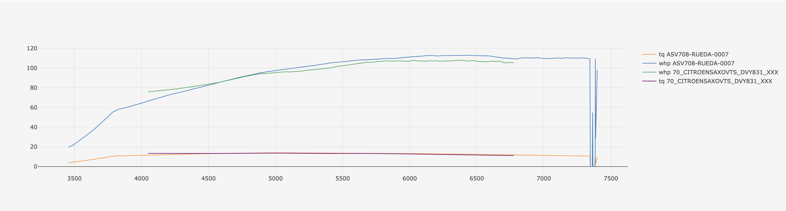
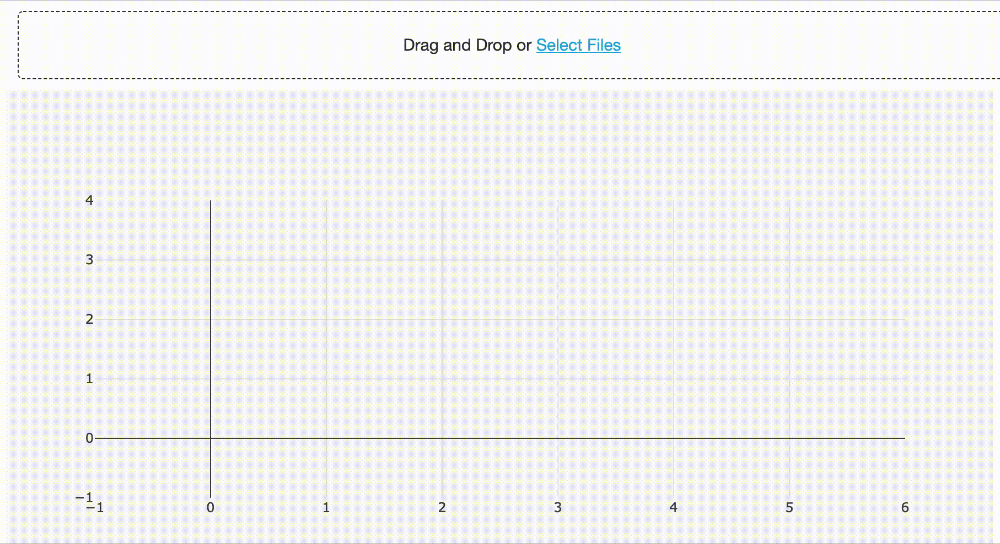

# Dyno plots

Dyno plots is a web tool created to help compare dyno runs done on [MWD](http://www.mwdyno.com/) and [Horacio Resio](http://www.horacioresio.com/) dynos. Dyno plots allow to compare multiple runs with mixed dyno sources (i.e. a MWD run with a Horacio Resio run)

## Install
```
virtualenv venv
source venv/bin/activate
pip install -r requirements.txt
```

## Run
```
python app.py
```

## Access
> http://127.0.0.1:5001/

## Demo

