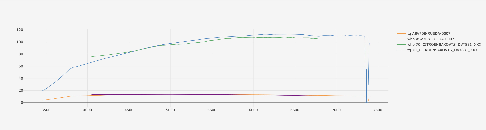
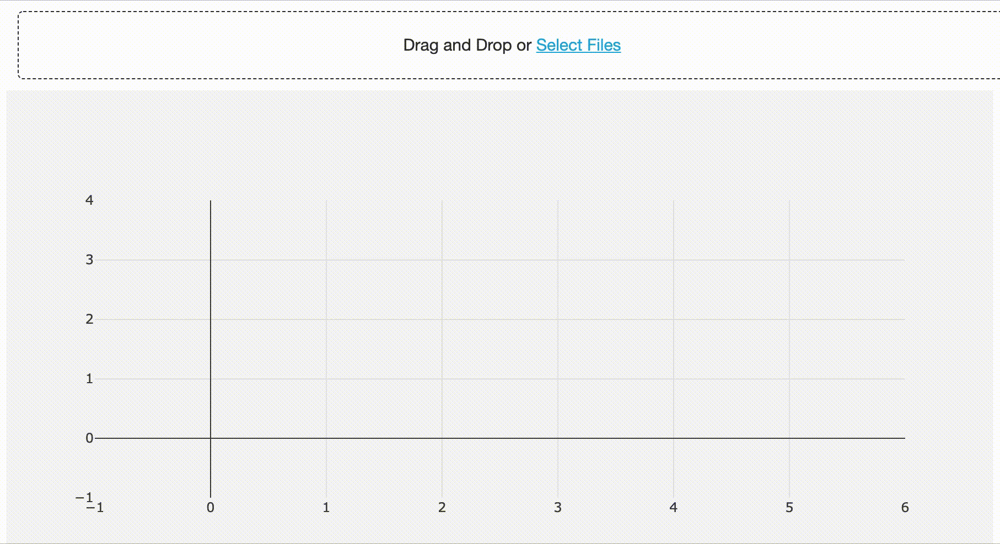

# Dyno plots



Dyno plots is a client-side web tool to compare dyno runs from
[MWD](http://www.mwdyno.com/) and [Horacio Resio](http://www.horacioresio.com/)
dynos. Multiple runs with mixed sources can be compared at once (e.g. a MWD run
against a Horacio Resio run).

It is now a fully static [Next.js](https://nextjs.org/) app — all file parsing
and plotting happen in the browser, so there is no server to run and it deploys
to Cloudflare Pages or Vercel as static assets.

## Supported formats

- `.csv` — generic file with an `rpm`, `hp`, `tq` header
- `.ine` — Horacio Resio
- `.ad3` — MWD

Don't have a file at hand? Use the [samples](samples/) folder.

## Develop (containerized)

Everything runs inside Docker — no Node/npm on the host.

```
docker compose up
```

Then open <http://localhost:3000/>. The `.devcontainer` config points at the
same compose service for VS Code Dev Containers.

If you reach the dev server through a non-localhost hostname, add it to
`allowedDevOrigins` in `next.config.mjs` — otherwise Next 16 blocks dev
assets/HMR cross-origin and the page renders but never becomes interactive.

## Build static site

```
docker compose run --rm web npm run build
```

The static site is written to `out/`.

## Preview the production build

Serves the static `out/` exactly as it deploys (no dev server / HMR):

```
docker compose run --rm web npm run build
docker compose run --rm --service-ports web npm run preview
```

## Deploy

- **Cloudflare Workers Builds** — connect the repo as a **Worker** (not
  Pages). `wrangler.jsonc` is an assets-only Worker serving `./out`. Settings:
  build command `npm run build`, deploy command `npx wrangler deploy`, root
  directory `/`. Workers Builds injects account credentials, so **no
  `CLOUDFLARE_API_TOKEN` is needed**. Every push to `master` auto-deploys.
- **Vercel** — zero config; the static export is detected automatically.

## Demo


